<div align="center">


### Makone

**Make Worlds with Code**

Turn a prompt into a **scene** you walk through, a **game** you can lose,
or an **object** you turn over in your hands.

[](https://makone.dev)
[](LICENSE)
[](package.json)
[](https://threejs.org)
[](CONTRIBUTING.md)

[**makone.dev**](https://makone.dev) · [Gallery](#gallery) · [How it works](#how-it-works) · [Quick start](#quick-start) · [Docs](#documentation)

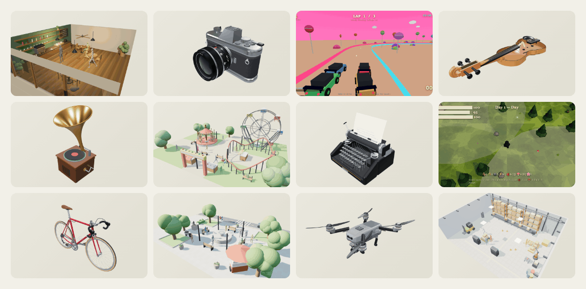

<sub>Every polygon above is procedural source. No imported meshes, no texture packs, no binary assets.</sub>

</div>

### How it works

An agent writing 3D code cannot see what it made. It writes a thousand lines of geometry,
reports success, and has no idea the canvas is black.

Makone closes that loop. No server, no API key, nothing to configure — **the agent is the
coding agent you already use.** This repository gives it the three things it lacks:

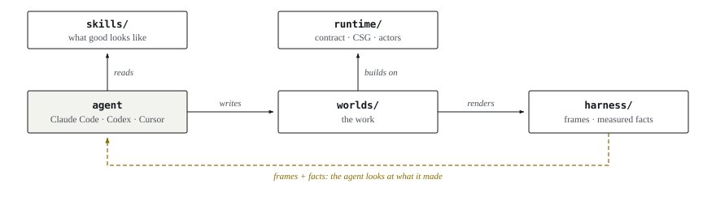

*Figure 1: The three layers a coding agent does not bring with it. The dashed edge is the one that matters — without it the agent is writing 3D code blind.*

The delta is **eyes**. Everything else an agent loop needs — context, edits, a shell —
already exists in the CLI you are running; rebuilding it here would be a worse copy.
`capture` takes the screenshot, `verify` takes the measurement, and the agent has to look
at both before it may claim the work is done.

### Quick start

**1 · Look at what is already here.**

```bash
git clone https://github.com/wormholeportal/Makone && cd Makone
npm install
npm run serve            # http://localhost:5180 — the gallery
```

`npm run serve` puts the gallery on **http://localhost:5180** — every world, filterable by
type, each card animating on hover:

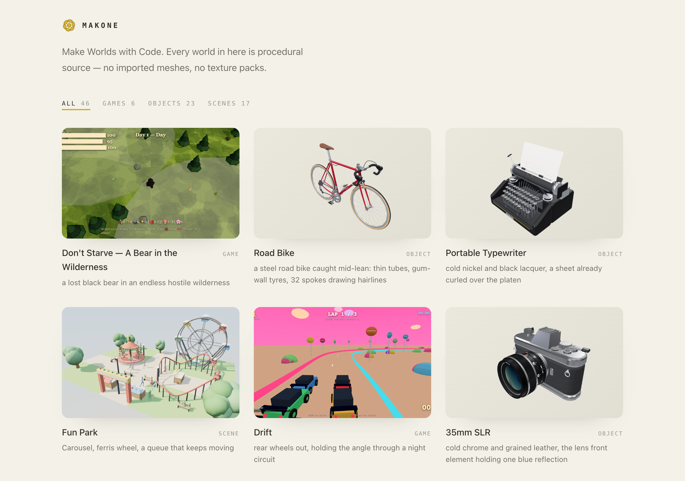

Click a card to open it in the player (`play.html?world=<world>`) — drag to orbit, scroll to
zoom, and for a game the keys are printed at the bottom of the frame.

Prefer not to run anything? Every world also ships as a single self-contained `.html`.
`worlds/<world>/<world>.html` opens straight from disk by double-clicking it — no server, no
install, everything inlined down to the WASM.

**2 · Give the agent its eyes.** One-time, and only needed for creating:

```bash
npx playwright install chromium
```

**3 · Make something.** Open the repo in your agent CLI — Claude Code, Codex, Cursor,
whichever you use — and ask in plain language:

> make a fishing harbour at 4am, wet light, someone already at work

That sentence is the **brief**. It is the one thing you declare before any code, it is
stored in `world.json`, and it is what every later pass is scored against — *is this frame
closer to that, or not?* Write it concrete enough to smell; a brief nobody can fail is
not one.

[`AGENTS.md`](AGENTS.md) is the entry point the agent reads. It routes to the right skill,
then holds the agent to the loop: build it, screenshot it, look, fix the weakest frame,
repeat. You do not run the harness by hand — the agent does, and shows you the frames.

> **Browsing only?** `npm install --omit=dev` skips Playwright and its browser download.

### Gallery

Every world is procedural code. Hover a card in the local gallery to see it move; click
through to read the source that made it.

<!-- gallery:start -->
### Scenes · 6

A place that exists and keeps living. Judged by whether a still frame holds up — and whether anything moves when nobody touches it.

<table>
<tr>
<td width="50%"><a href="worlds/cafe">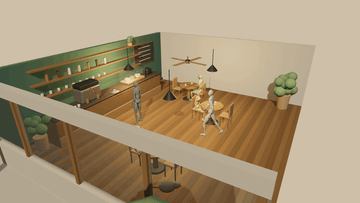</a></td>
<td width="50%"><a href="worlds/factory">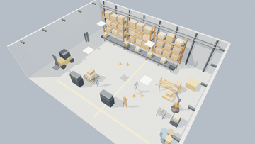</a></td>
</tr>
<tr>
<td><strong><a href="worlds/cafe">Corner Café</a></strong> — A waiter runs trays, patrons sip, the barista works the machine</td>
<td><strong><a href="worlds/factory">Assembly Floor</a></strong> — Workers threading between robot arms and AGVs</td>
</tr>
<tr>
<td width="50%"><a href="worlds/farm">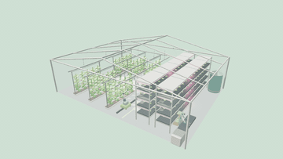</a></td>
<td width="50%"><a href="worlds/funpark">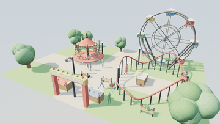</a></td>
</tr>
<tr>
<td><strong><a href="worlds/farm">Farm</a></strong> — Livestock, a tractor, a day of chores</td>
<td><strong><a href="worlds/funpark">Fun Park</a></strong> — Carousel, ferris wheel, a queue that keeps moving</td>
</tr>
<tr>
<td width="50%"><a href="worlds/kitchen">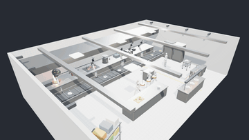</a></td>
<td width="50%"><a href="worlds/plaza">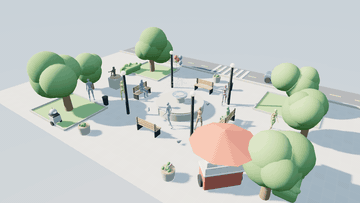</a></td>
</tr>
<tr>
<td><strong><a href="worlds/kitchen">Kitchen</a></strong> — Prep, wok, plate — the line in motion</td>
<td><strong><a href="worlds/plaza">City Plaza</a></strong> — Traffic, pedestrians and a fountain</td>
</tr>
</table>

### Games · 6

A place with a verb and a way to lose. Judged by whether there is a decision every few seconds.

<table>
<tr>
<td width="50%"><a href="worlds/battlecity">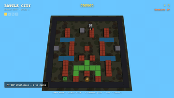</a></td>
<td width="50%"><a href="worlds/crossyroad">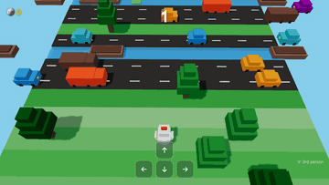</a></td>
</tr>
<tr>
<td><strong><a href="worlds/battlecity">Battle City</a></strong> — Top-down tank duel in a brick maze, with one base to hold</td>
<td><strong><a href="worlds/crossyroad">Crossy Road</a></strong> — One hop at a time across traffic, river and rails — the road never ends, only your nerve does</td>
</tr>
<tr>
<td width="50%"><a href="worlds/dontstarve">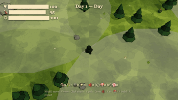</a></td>
<td width="50%"><a href="worlds/drift">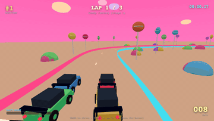</a></td>
</tr>
<tr>
<td><strong><a href="worlds/dontstarve">Don't Starve — A Bear in the Wilderness</a></strong> — A lost black bear in an endless hostile wilderness</td>
<td><strong><a href="worlds/drift">Drift</a></strong> — Rear wheels out, holding the angle through a night circuit</td>
</tr>
<tr>
<td width="50%"><a href="worlds/pacman3d">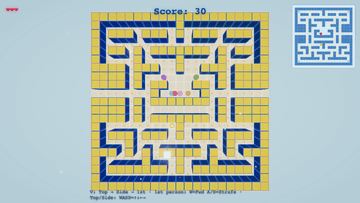</a></td>
<td width="50%"><a href="worlds/snowdrift">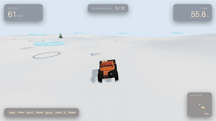</a></td>
</tr>
<tr>
<td><strong><a href="worlds/pacman3d">Pacman 3D</a></strong> — The maze chase, rebuilt in three dimensions</td>
<td><strong><a href="worlds/snowdrift">Snowdrift</a></strong> — Plough the drifts back before the storm buries the road</td>
</tr>
</table>

### Objects · 6

One thing, built to be turned over. Judged by whether the form reads from every angle.

<table>
<tr>
<td width="50%"><a href="worlds/bicycle">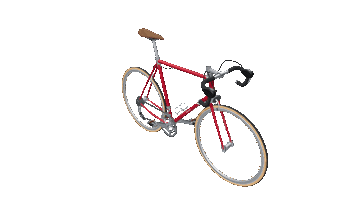</a></td>
<td width="50%"><a href="worlds/camera">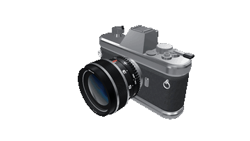</a></td>
</tr>
<tr>
<td><strong><a href="worlds/bicycle">Road Bike</a></strong> — A steel road bike caught mid-lean: thin tubes, gum-wall tyres, 32 spokes drawing hairlines</td>
<td><strong><a href="worlds/camera">35mm SLR</a></strong> — Cold chrome and grained leather, the lens front element holding one blue reflection</td>
</tr>
<tr>
<td width="50%"><a href="worlds/drone">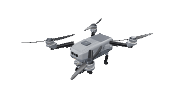</a></td>
<td width="50%"><a href="worlds/gramophone"></a></td>
</tr>
<tr>
<td><strong><a href="worlds/drone">Camera Quadcopter</a></strong> — Matte grey composite and carbon, four blades feathered, the gimbal hanging level</td>
<td><strong><a href="worlds/gramophone">Gramophone</a></strong> — Brass catching a single window's light in a quiet room</td>
</tr>
<tr>
<td width="50%"><a href="worlds/typewriter"></a></td>
<td width="50%"><a href="worlds/violin">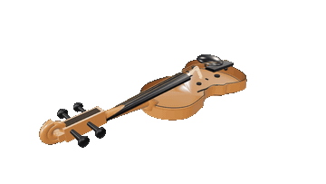</a></td>
</tr>
<tr>
<td><strong><a href="worlds/typewriter">Portable Typewriter</a></strong> — Cold nickel and black lacquer, a sheet already curled over the platen</td>
<td><strong><a href="worlds/violin">Violin</a></strong> — Spruce and flamed maple under old varnish, four strings caught over the bridge</td>
</tr>
</table>
<!-- gallery:end -->

### Three kinds of world

One directory, one contract, three intents. `type` is the only thing you declare; the
harness works out the rest by probing what your module actually implements.

| | **scene** | **game** | **object** |
|---|---|---|---|
| **What it is** | a place that exists and keeps living | a place with a verb and a loss condition | one thing, built to be turned over |
| **You judge it by** | does a still frame hold up | is there a decision every few seconds | does the form read from every angle |
| **Typical build** | procedural geometry, staged light, actors | ECS-ish state, input, physics where it earns it | CSG solids assembled from named parameters |
| **Extra contract** | — | `getState` · `act` · `observe`, so a bot can drive it | `params.js` + `parts/`, each part reviewable alone |
| **Skills** | `world/` + `craft/` | `+ game/` | `+ object/` |

```bash
npm run capture -- cafe --shots 4 --after 6        # orbit a scene after 6 simulated seconds
npm run verify  -- dontstarve                      # contract, console, budget, motion
npm run inspect -- gramophone --part horn          # contact sheet + facts for one part
```

### How a world is built

```js
// worlds/<world>/main.js
export default function createWorld(container) {
  // ... build the scene ...
  return { getScene, getCamera, getRenderer, getCanvas, resize, dispose, renderFrame };
}
```

```jsonc
// worlds/<world>/world.json
{
  "name": "<world>",
  "title": "Cold Harbour",
  "type": "scene",
  "brief": "4am at the fishing harbour, wet light, someone already at work",
  "budget": { "tris": 300000, "drawCalls": 300 }
}
```

`renderFrame(dt)` **is** the loop — the page owns `requestAnimationFrame`. That single
rule is what lets a script step a world deterministically, screenshot it headlessly, and
get the same frames twice. Full contract: [`docs/contract.md`](docs/contract.md).

`brief` is not a comment. It is the thing every self-review is measured against:
*does this frame get closer to that?*

### The loop

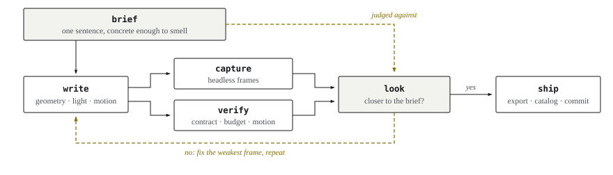

*Figure 2: One pass. The brief is declared once, before any code, and every pass is scored against it.*

```bash
npm run create  -- <world> --type scene --brief "..."     # scaffold + register
npm run capture -- <world> --shots 4                      # frames to look at
npm run verify  -- <world>                                # errors, contract, budget, motion
npm run export  -- <world>                                # one self-contained .html
npm run smoke                                             # end-to-end self-check
```

`verify` reports facts, not claims: whether anything visibly **moved** over six simulated
seconds, whether `seekTo(0)` and `seekTo(1)` actually differ, triangles and draw calls
against the budget you declared. A world that says it is alive and renders a still image
fails.

#### Where the output lands

| Where | What lands there |
|---|---|
| `worlds/<world>/shots/` | the frames `capture` and `inspect` just wrote — **this is what you open and look at**. Review artifacts: read them, do not commit them |
| stdout | `verify` prints one JSON object — pass/fail, measured motion, luma, triangles, draw calls |
| **http://localhost:5180** | the gallery, once `catalog` has picked the world up. The card is live: hover to see it move, click to play it |
| `worlds/<world>/<world>.html` | after `export` — one file, double-click it, works with no server |

A new world shows up in the gallery only after `npm run catalog` regenerates
`worlds/index.json`; `npm run create` already does that for you, and `npm run check` fails
if the catalog has gone stale.

### Repository map

```
skills/     knowledge, loaded on demand
  world/      the six-step workflow — start here, works for all three types
  craft/      cross-cutting technique: form, light, colour, actors, motion, performance
  game/       game design: feel, mechanics, onboarding, genre playbooks, honesty gates
  object/     cutting a thing into parts and reviewing one alone
  three/      Three.js API reference and engine engineering — lookup, not design
harness/    deterministic scripts, one verb each
            serve · create · capture · verify · catalog · export · inspect · smoke
runtime/    the browser side
            world.js (contract) · solid.js (CSG) · actors.js (people) · studio.js (parts)
worlds/     the works — one directory each, plus a generated index.json
            <name>/  world.json · main.js (+ params.js, parts/) · cover.png · <name>.html
docs/       architecture.md · principles.md · contract.md · walkthrough.md
index.html  gallery        play.html  player (humans and the harness use the same page)
```

### Design decisions worth knowing

- **No asset imports.** Form comes from geometry, CSG and shaders; people come from
  `mannequin-js`. A world is readable, diffable source — not a binary you cannot review.
- **Declare intent, probe capability.** `world.json` carries what you *meant*
  (`type`, `brief`, `budget`). Whether a world has a timeline or can be played is read
  off the module itself. A declaration can lie; a probe cannot.
- **One loop, one page.** Humans and the harness both load `play.html`. What you see is
  what CI tested.
- **Skills unlock, they do not constrain.** The only hard goals are visual quality and,
  for games, playability. No checklists to satisfy.

### Documentation

| Document | What is in it |
|---|---|
| [`docs/architecture.md`](docs/architecture.md) | Every decision and the reasoning behind it — layers, contracts, what was rejected |
| [`docs/principles.md`](docs/principles.md) | Engineering axioms distilled from real bugs. Re-read before every session |
| [`docs/contract.md`](docs/contract.md) | The WorldModule contract, method by method |
| [`docs/walkthrough.md`](docs/walkthrough.md) | One world from prompt to finished frames |
| [`AGENTS.md`](AGENTS.md) | The agent entry point — routing, hard rules, the harness loop |

### Prior art

Built on [three.js](https://threejs.org), [manifold-3d](https://github.com/elalish/manifold), [mannequin-js](https://github.com/boytchev/mannequin.js).

### Contributing

New worlds, new skills, fixes — see [`CONTRIBUTING.md`](CONTRIBUTING.md). One hard rule:
**a change you can see arrives with the frames that show it.**

### Licence

MIT — see [`LICENSE`](LICENSE).
