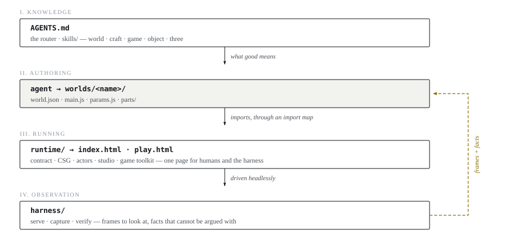

# Architecture

> **Make Worlds with Code.**

Makone is one repository: **skills** (knowledge), **runtime** (browser-side libraries) and
**harness** (deterministic scripts). You clone it, open it with your own coding agent, and
build worlds. There is no resident process anywhere — no server, no backend, no API keys.

The entry point for an agent is `AGENTS.md`.

---

## 1. Core decisions

### D1 — The agent is your coding agent; there is no agent loop in this repo

Everything an agent loop needs already exists in the CLI you are running: streaming,
context management, cost accounting, subagents, file edits, shell. Rebuilding any of it
here would be a worse copy that has to be maintained.

What this repo adds is the part a general coding agent does not have — **eyes**.
`harness/capture.mjs` takes headless screenshots so the agent can look at what it wrote.
That is the whole delta, and it is why the three layers are skills, runtime and harness
and nothing else.

Checkpoints are git commits. Rollback is `git revert`. Asking the user something is just
talking.

### D2 — `worlds/` is flat; classification is an attribute, not a directory

```
worlds/
├── index.json          # GENERATED by harness/catalog.mjs — the single data contract
├── <world>/            # one world = one directory, carrying its own world.json,
└── <world>/            #   its cover, and its single-file export
```

**A world directory holds everything about that work, generated artifacts included:**
`world.json` + `main.js` (+ `params.js`, `parts/` for objects) + `cover.png` + `<name>.html`.
One directory is the unit you copy, share or delete, and the export means anyone can open
the work by double-clicking it — no clone, no install.

Review frames land in the same directory, under `shots/`, because a work is judged by its
frames and they belong next to the code that made them. They are **review artifacts, not
history**: a single `inspect` pass writes dozens of near-identical PNGs, so look at them,
then keep them out of the commit. The frames that matter go in the pull request, where a
reviewer actually reads them.

There are **no `scenes/` `games/` `objects/` subdirectories**. Classification lives in
`world.json`:

- `type` = what it is: `scene` · `game` · `object` (a thing you hold in your hand).
  **Open set**: adding `film` / `character` / `kit` later requires no code change — the
  gallery's tabs are generated from whatever types appear in the catalog. This is the only
  hand-written classification field and the harness never reads it (D6), so adding values
  cannot break a script. **The three existing values cannot change**: a downstream
  consumer's whole information architecture, URLs and structured data are built on them.
- `format` = how it runs. There is exactly one value, `module`: a WorldModule directory
  (`world.json` + `main.js`). The field survives so the catalog stays self-describing and
  a future format has somewhere to land.

Why flat: worlds people generate land in `worlds/` too, and making them decide "is this a
scene or a game?" is pointless friction. One directory plus one `type` field is enough,
and reclassifying is a one-line JSON edit rather than a file move.

`worlds/index.json` is generated by `harness/catalog.mjs` from each `world.json`
(`--check` makes it a CI gate). Gallery, harness and downstream consumers read only that
file.

### D3 — Geometry kernel: three.js + manifold-3d

| | B-rep CAD (build123d / OpenCASCADE) | Makone |
|---|---|---|
| Kernel | B-rep, Python 3.11+ | three.js + manifold-3d (mesh CSG), pure JS/WASM |
| Goal | manufacturing: STEP/STL/3MF, printing, robots | worlds: interaction, motion, stylization |
| Runtime | local Python execution | entirely in the browser |

Different kernels, different goals. Every solid operation world-building needs — boolean,
hull, shell, revolve — is covered by manifold. Pulling in OpenCASCADE means dragging a
Python dependency chain behind it, which breaks "clone and run". If you need
engineering-grade export, install a CAD skills library alongside; the two compose.

### D4 — Pure-code assets (the unchanging iron law)

No external GLTF or texture libraries. Form comes from procedural geometry, CSG and
shaders; characters come from `mannequin-js`. A world stays readable, diffable source —
not a binary nobody can review.

### D5 — The feedback loop is a hard convention, not a suggestion

```
write code → serve → capture (moments / camera angles / burst) → the agent looks and reviews honestly
      → score it against the skill's visual-language standard → fix → until it converges
games add: bot self-play over N runs → metrics + process frames → judge "a decision every few seconds"
```

The agent instructions state it as a hard rule: **no screenshot evidence, no claiming it
is done.** A skeleton that passes an audit is not a work with a soul, and self-review has
to be forced to be honest — which is what the measured facts in D6 are for.

### D6 — The author declares **intent**; the machine **measures** facts

`world.json` carries exactly one classification field, `type`. Everything else about what
a world *can do* is a health report probed or measured by the harness.

Making the author hand-write something the machine can read for itself is the single
source of classification chaos: a declaration and the fact **can disagree** — "declared
alive, actually a still image" — and that disagreement is exactly the failure the loop
exists to catch. A probe and a measurement cannot disagree, because the fact is read out
of the code and out of the picture. This is what D5 needs to work: forced honesty.

Author-written (intent + north star):

```json
{ "name": "<world>", "title": "…", "type": "object",
  "brief": "a bright rim of light along the brass bell in side lighting",
  "key": "natural",
  "budget": { "tris": 200000 } }
```

Machine-read (health report, authors never write these):

| Field | Where it comes from | Consumer |
|---|---|---|
| `interactive` | `typeof world.act === 'function'` | bot play |
| `timeline` | `typeof world.seekTo === 'function'` | capture shot-selection |
| `animated` | **measured**: fraction of changed pixels after 6 s of `step` > 0.5% | honest health check |
| `luma` | **measured**: median / crushed / peak-bright of the rendered frame | key gate |
| `tris` / `drawCalls` | **measured**: the scene graph is walked and summed | budget gate |
| `frameMs` | **measured**: median of 25 frames, GPU-synced via `readPixels` | comparative cost |

**`key` is the second declared-intent-plus-measurement pair**, and it exists because of a
demonstrated drift. Thirteen worlds were built in one run; the draw-call budget — a number —
caught five mistakes, the timeline check — a number — caught six. Darkness had no number, and ten
scenes in a row came out night, dusk, underwater or underground with nothing to say so. Every bar
that held in this repo held because it was measured.

> The budget gate itself later proved that a measurement can also drift — into silence. It read
> `renderer.info`, which is reset on every `renderer.render()` call, so a world rendering through
> an `EffectComposer` reported only its last pass: a full-screen quad. `erdtree` — 181 meshes,
> ~614k triangles — measured as `{triangles: 1, drawCalls: 1}` and passed a 900k budget without
> comment. Four worlds were affected. The gate now walks the scene graph, which does not care how
> a world chooses to render. **A number that can only ever pass is worse than no number**, because
> it is also a claim that somebody checked.

So `key` (`natural` · `low` · `high`) is declared like `budget`, and `verify` samples the frame
three times over six seconds and reports `luma`:

| Statistic | Meaning |
|---|---|
| `median` | luminance of the median pixel, after tone mapping — the eye's number, not the shader's |
| `dark` | share of the frame below 5% luminance: how much is crushed to unreadable |
| `bright` | **peak** share above 55% across the samples: does this world ever show you a highlight |

The gate is deliberately not "brighter is better". A deep-sea scene that declares `low` and comes
out nearly black is correct — 2500 m down there is no ambient light. What fails is a `natural`
world that has collapsed into the bottom of its range, and a `low` world with no lit focal subject
at all, which is mud rather than mood. Thresholds live in `harness/verify.mjs` and were calibrated
across the whole library, the same way `MOTION` was.

Health-report fields appear in `verify.mjs` stdout, not in `index.json` — `catalog.mjs`
reads only author fields and cannot measure anything. They get folded in when a consumer
actually needs them.

**`animated` matters most**: it is the only falsifiable definition of a living scene —
touch no input, and after six seconds of `step` the picture must change.

The statistic is the **fraction of changed pixels** on a 96×96 frame (single-channel diff
> 10 counts as changed), not the mean difference. Averaging over the whole frame dilutes
local motion to nothing: a scene with drifting steam and two walking figures measures
0.0014 by mean and reads as static. Calibration across the library:

| motion | verdict | what it is |
|---|---|---|
| 0 | ❌ | a lamp, a teapot — objects that do not move on their own |
| 0.0011 | ❌ | a record turning 7.8 times in 6 s: rotationally symmetric, so **spinning looks like not spinning** |
| 0.0078 | ✅ | the quietest living scene, still 1.6× the threshold |
| 0.011 – 0.03 | ✅ | steam and NPCs · machines · a carriage crossing the frame |
| 0.06 – 0.16 | ✅ | a busy café · a rotating lighthouse beam, the reference ceiling |

The threshold is **0.005**, which is a *visible* line, not an *is anything moving* line.
`animated: false` with `motion: 0.0011` is the most honest report a spinning record can
get: the thing moves, but you cannot tell — which is exactly what the author needs to know.

The harness picks its shot method from the same probes, so the author supplies no flag:

```
has seekTo  → capture --at sampling (time-addressable; seeking the same t twice must match)
otherwise   → step first, then shoot
has act     → a bot can drive it
```

`assertContract` has exactly one meaningful check, **method-family completeness**:
`seekTo` requires `play` / `pause` / `getProgress` / `duration`; `act` requires `getState`
/ `observe`. Half a timeline is worse than no timeline.

Because `type` carries no technical semantics, "is a playable Rubik's cube an object or a
game?" is an **editorial judgment the author makes**. No derivation rule — the author
knows better than any inferred one.

### D7 — Parts are first-class, and are the supply chain for scenes and games

The hard part of a complex object is not a shortage of CSG operators, it is that **the
iteration grain is too coarse**. A gramophone written as an 800-line `main.js` means
changing one bell requires rerunning the whole world and looking at one wide shot. The
loop cannot converge on that.

```js
// worlds/<name>/parts/<part>.js
export const params = { hornLength: 0.42, bellRadius: 0.19 };  // named params = single source of truth
export const inventory = ['3mm rolled lip on the bell', '6 rivets on the brass fittings'];
export default function build(p = params) { return object3d; } // pure function
```

Three hard conventions:

1. **Pure function** — no `new Scene`, no event listeners, no reading `window`, or the
   harness cannot instantiate the part alone.
2. **Datum** — `y=0` is the ground plane, `+Z` is the front, units are meters.
3. **Pivot naming** — moving parts are exposed via `name` (`getObjectByName('lid')`).

Rule 3 lets one part span two scales: **the same part is static inside an object and
openable inside a game.**

The eyes reuse the same pipeline; there is no second stove. `runtime/studio.js` wraps any
part into a temporary world that satisfies the WorldModule contract (three-point lighting,
grey backdrop, a 1.7 m figure for scale), so `play.html`, `lib.mjs` and the screenshot
pipeline are reused verbatim.

```bash
node harness/inspect.mjs <world> --part horn             # three-view + turntable sheet + dimension facts
node harness/inspect.mjs <world> --part horn --ref a.jpg # reference image side by side
node harness/capture.mjs  <world> --ref wide.jpg         # scene scale can go side by side too
```

| Scale | Observation script | Ground truth — only what is measurable, never a scoring rubric |
|---|---|---|
| part | `inspect` three-view + dimension table | measured bbox · `inventory` line by line · reference side by side |
| object / scene | `capture` orbit / moments | `brief` · reference side by side · `animated` |
| game | bot self-play | metrics · "a decision every few seconds" |

**Downstream may not consume ungated upstream:**

```
part passes inspect ──▶ only then may a scene import it ──▶ only then may gameplay hang a pivot on it
```

The supply-chain view is the point. A complex scene looks empty and has to be propped up
by darkness and bloom because every object is a primitive rubbed together on the spot,
with nobody responsible for any single piece. With a batch of parts that passed inspect,
detail density is **accumulated** rather than filtered on — and the whole path stays pure
code, so D4 holds.

Parts live in `worlds/<name>/parts/` first; only when a third world needs one does it get
promoted. **Do not build an asset library ahead of demand.**

Three defects the part loop caught on its first outing were **all caught by the harness,
not by the eye** — which is the whole reason it exists:

| Defect | Who caught it |
|---|---|
| a crease at the seam between bell and elbow | `inspect`'s top orthographic view |
| the tonearm cannot reach the record, and passes through it | fact-table arithmetic: post→platter centre 0.184 m vs arm length 0.185 m |
| the record renders blown-out white at two azimuths and black at a third | `capture --ref` A/B — a single screenshot never shows this |

What is deliberately *not* borrowed from image-matching pipelines: colour-difference gates,
family contracts, per-region confidence scores. Those evolve into checklist bloat, and
skills must liberate rather than constrain. The criterion is: **only add measurable ground
truth — dimensions, pixel diffs, side-by-side images, bot metrics — never a subjective
rating scale.**

---

## 2. Directory structure

```
Makone/
├── AGENTS.md                  # thin router: recognize intent → load skill → enforce the harness loop
├── README.md                  # vision + three-minute quickstart
├── docs/
│   ├── architecture.md        # this file
│   ├── principles.md          # engineering axioms distilled from real bugs
│   ├── contract.md            # the WorldModule contract in full
│   └── walkthrough.md         # one world, start to finish
├── skills/                    # knowledge layer: five layers, each with one job (see skills/SKILL.md)
│   ├── world/                 # ★ the master workflow: brief → blocking → build → light → animate → finish
│   ├── craft/                 # general craft: form · characters · light · colour · contrast · motion · performance
│   ├── game/                  # game-specific: axioms · feel · mechanics · onboarding · narrative · playbooks
│   ├── object/                # cutting a thing into parts and reviewing one alone
│   └── three/                 # three.js API reference + engine engineering (lookup, not design)
├── runtime/                   # shared browser runtime (ESM, straight from an import map, no build step)
│   ├── world.js               # WorldModule contract + loader (§4)
│   ├── solid.js               # CSG helpers over manifold-3d (pairs with skills/craft/solid.md)
│   ├── actors.js              # NPCs: navigation + routines + poses (pairs with skills/craft/actors.md)
│   ├── studio.js              # wrap any part into a temporary world (D7)
│   └── game/                  # game-feel toolkit: HUD, particles, screen shake, timers
├── harness/                   # deterministic script layer — the agent's hands and eyes
│   ├── serve.mjs              # static dev server (zero deps, plain node:http)
│   ├── capture.mjs            # Playwright frames: --shots/--arc/--at/--after/--size/--ref
│   ├── inspect.mjs            # single-part four-view sheet + dimension facts (--part/--ref/--views)
│   ├── sheet.mjs              # the sheet composer shared by capture and inspect
│   ├── verify.mjs             # console errors, contract completeness, budget, measured motion
│   ├── catalog.mjs            # worlds/*/world.json → worlds/index.json (--check as a gate)
│   ├── export.mjs             # one world → a single self-contained HTML (three/runtime/wasm inlined)
│   ├── create.mjs             # scaffold: create <name> --type scene --brief "..."
│   └── lib.mjs                # shared: server + chromium + wait for ready + collect console
├── worlds/                    # the works: flat, one directory per world + a generated index.json (D2)
├── index.html · play.html     # gallery + player
└── package.json               # deps from npm (three / manifold / mannequin), no build step
```

## 3. Layers and data flow



*Figure 1: The four layers. Each one answers a different question — skills what is good, harness whether it is true, runtime how it runs.*

One sentence each: **skills decide "what is good", harness decides "is it actually true",
runtime decides "how it runs".**

The pages are plain static files — any static host can serve them; locally use
`harness/serve.mjs`. `file://` does not work, because ESM, `fetch(world.json)` and
`/node_modules` all need a served root. For a world that opens by double-click, use
`harness/export.mjs`.

## 4. The WorldModule contract

```js
// worlds/<name>/main.js
export default function createWorld(container, opts = {}) {
  return {
    // -- base (all required) --
    getScene, getCamera, getRenderer, getCanvas, getOrbitControls,
    resize, dispose, renderFrame(dt),   // renderFrame contains the self-driving tick

    // -- optional method families: implementing one declares it; the harness probes (D6) --
    // timeline family: all or nothing
    play, pause, seekTo(t), getProgress, duration,
    // playable family: all or nothing (bot-drivable is a hard requirement)
    getState(),        // serializable observation, including win/lose and terminal states
    act(input),        // inject input (key-level or command-level)
    observe(),         // compact observation from the bot's point of view
  };
}
```

```json
// worlds/<name>/world.json — intent and north star only, no capability declarations (D6)
{ "name": "<world>", "type": "scene", "entry": "main.js",
  "brief": "4am at the fishing harbour, wet light, someone already at work",
  "budget": { "tris": 300000, "drawCalls": 300 } }
```

- Capture, gallery and bot play depend on this contract and nothing else.
- `brief` is first-class. The north star — one concrete sentence worth being obsessive
  about — lives in the artifact's metadata, and every self-review scores against it.
- The playable family is designed so that **a bot can drive it**, or the self-play loop
  has nothing to hold on to.
- `assertContract` checks method-family completeness only (D6).

Full contract with method-by-method notes: [`contract.md`](contract.md).

## 5. Framework selection

| Framework | Verdict | Reason |
|---|---|---|
| three.js (r183+) | ✅ core | the unified base for rendering, interaction and motion |
| manifold-3d (WASM) | ✅ core | CSG: boolean / hull / shell |
| mannequin-js | ✅ in | pure-code characters; `runtime/actors.js` depends on it |
| Rapier3D | ✅ in (opt-in) | physics only for things that must move |
| Playwright | ✅ in (harness) | headless frames — the eyes |
| esbuild | ✅ in (export only) | `harness/export.mjs` bundles single-file HTML. **The dev flow stays zero-build** (serve + import map); esbuild is a devDependency and never enters `runtime/` |
| three-bvh-csg | 🟡 backup | stands in for manifold if real-time high-frequency booleans are ever needed |
| TSL / ShaderMaterial | 🟡 as needed | the stylized-rendering language, covered by `skills/three/` |
| replicad / openjscad | ❌ out | B-rep, heavy WASM, manufacturing-oriented — same reason as D3 |
| Theatre.js | ❌ out | the built-in timeline is enough; avoid an editor-state dependency |
| Gaussian splatting | ❌ out | not pure code; conflicts with D4 |

## 6. Naming conventions

- **World name: a single lowercase word**, no `-` or `_`. Two words run together beats a
  hyphen; if it needs three, the name is a description rather than a name.
- **Directory name: a single lowercase word** (`skills/craft/`, `runtime/game/`); pages
  inside a skill are kebab-case (`color-grammar.md`).
- **A harness script is one verb** (serve · capture · verify · catalog · create · inspect ·
  export), one word one job, flags uniformly `--flag value`. `lib.mjs` is a shared internal
  module, not a command, so it is not a verb. **Scripts are never nouns**: a noun does not
  say what it does, and `world` alone would collide with `runtime/world.js` (contract) and
  `skills/world/` (workflow).
- **Runtime files mirror craft pages by name**: `runtime/solid.js` ↔
  `skills/craft/solid.md`, `runtime/actors.js` ↔ `skills/craft/actors.md`.
- **JS**: variables and functions camelCase, classes and contract types PascalCase
  (`WorldModule`), module-level constants SCREAMING_SNAKE.
- **Classification**: `type` is the only hand-written classification field, values
  `object | scene | game` (open set, D6). "Alive" always goes through `brief`; the
  machine side says only `animated` (measured), `timeline` and `interactive` (probed).
- **Language**: everything in the repo — code, comments, docs, skills — is English. Speak
  to the user in whatever language they use. One concept gets exactly one name repo-wide
  (a world is never also called a scene, a level or a project).
